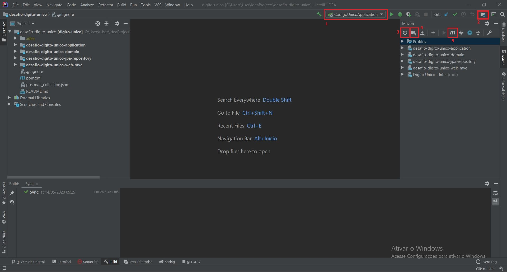
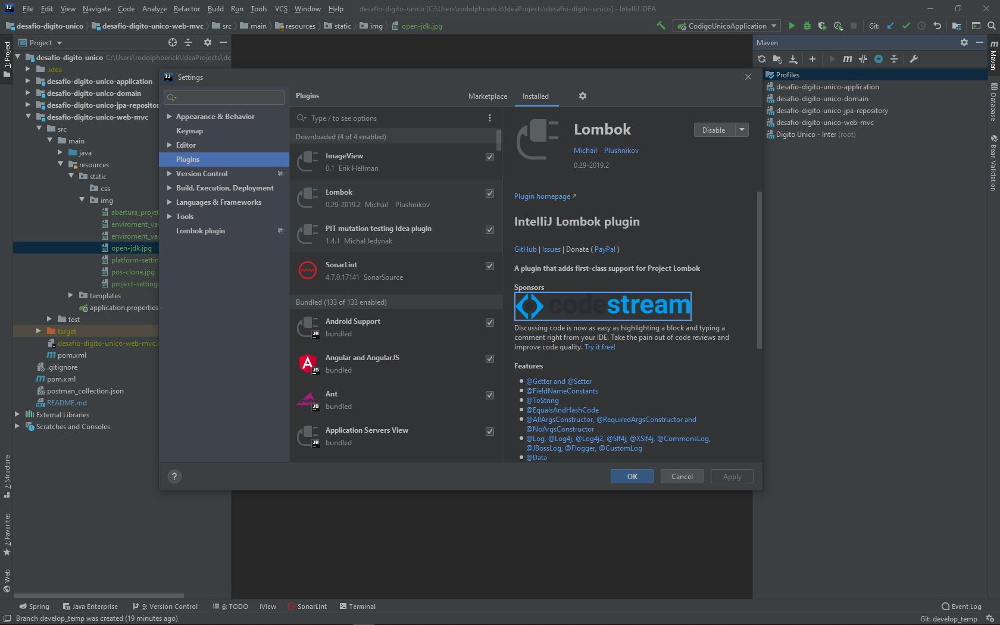
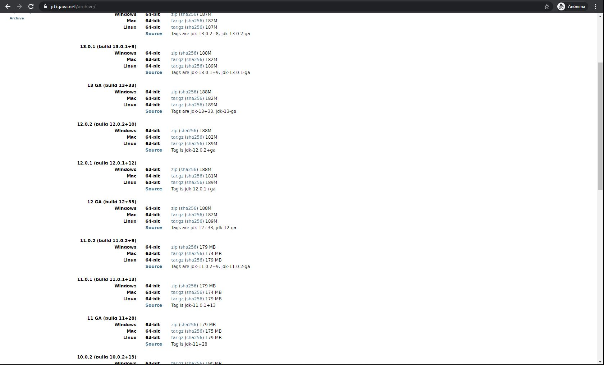
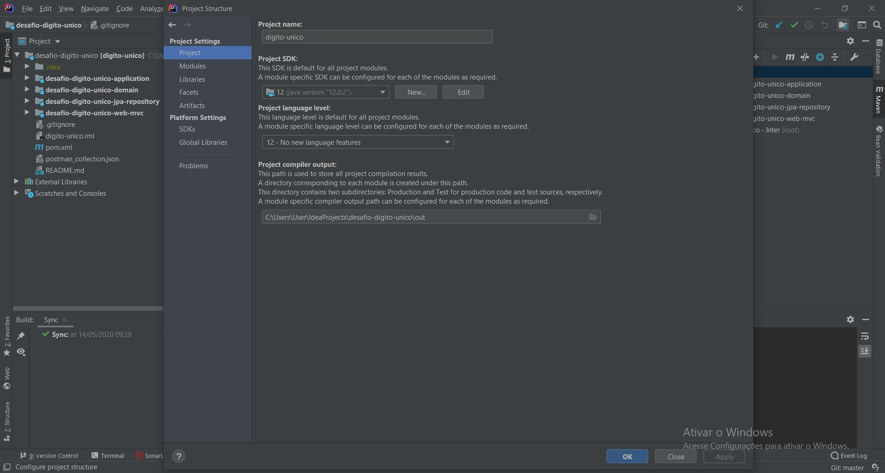
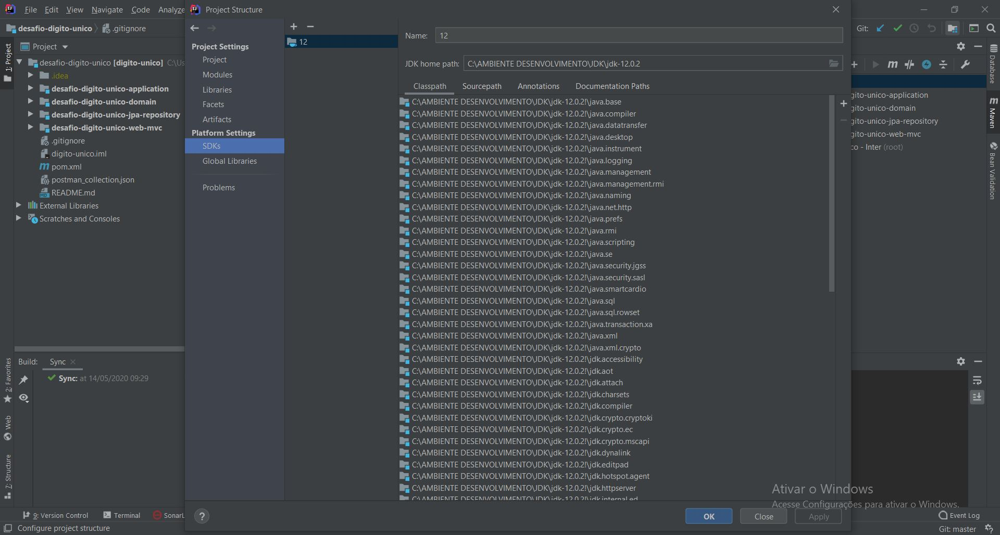
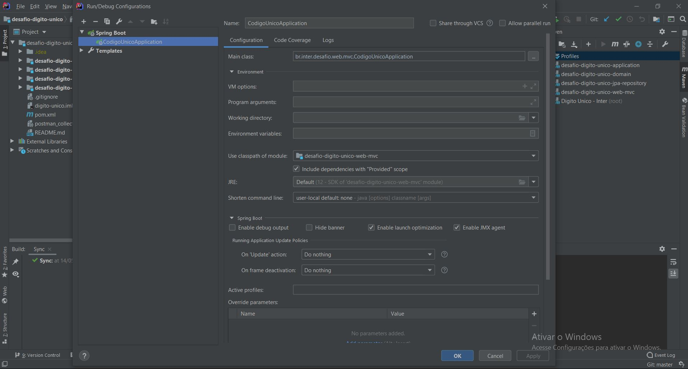
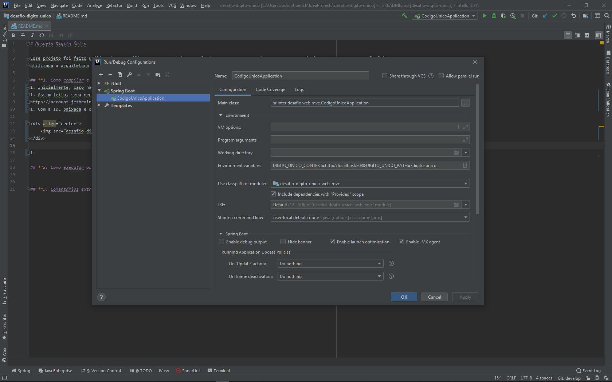
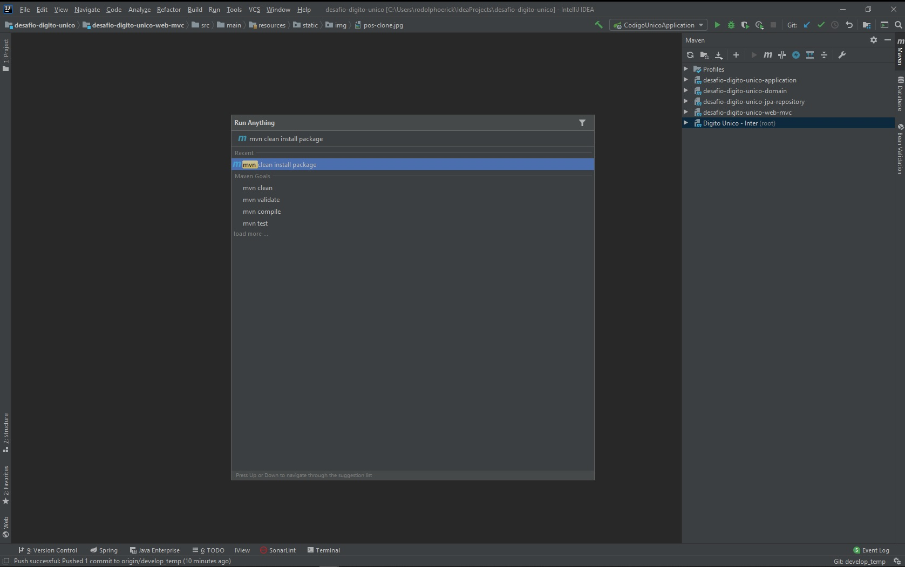
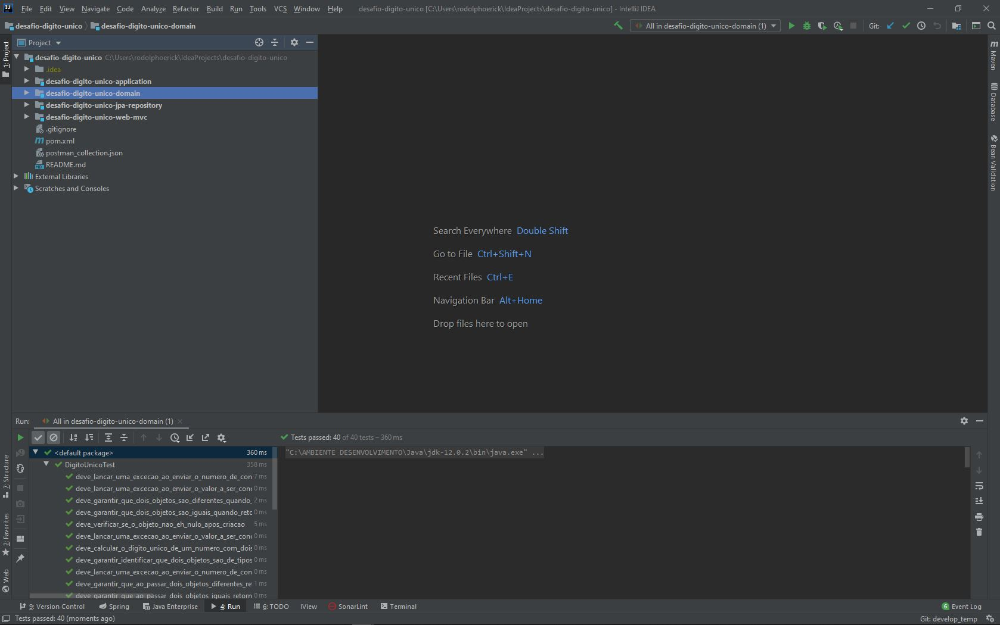
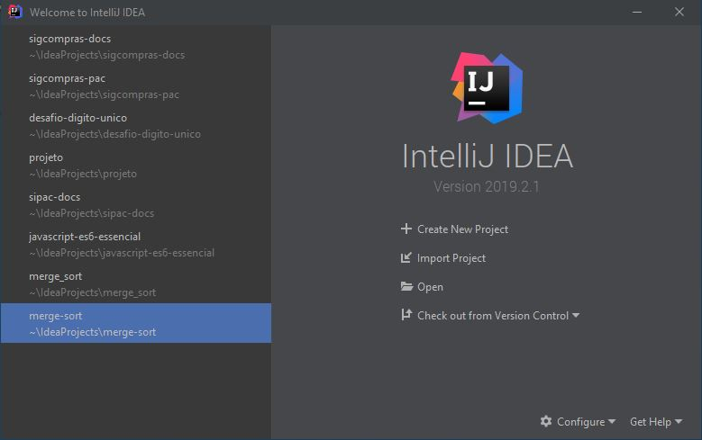

# Desafio Dígito Único

Esse projeto foi feito utilizando o IntelliJ IDEA com Lombok como plugin, Open JDK 12, Spring Boot, Maven, jUnit4 e Postman. 

## **1. Como compilar e executar a aplicação?**
1. Considerando que o desenvolvedor possui o IntelliJ instalado e configurado na máquina, e considerando também que já foi feito o 
clone do projeto, então a tela esperada é de acordo com a imagem abaixo:

**OBS.:** Caso não tenha o IntelliJ na sua máquina, a seção 3 abaixo explica como instalá-lo.

    
    
Imagem 1: Tela inicial do IntelliJ após clonar o projeto.

2. O próximo passo será realizar o download do plugin Lombok. Para isso pressione CTRL + ALT + S, vá em 'Plugins' e busque por Lombok, 
caso não o tenha instalado precisará instalá-lo e em seguida precisará reiniciar a IDE;

    
    
Imagem 2: Instalando plugin Lombok

3. Para os próximos passos, será necessário ter a OpenJDK 12 na máquina, caso não a tenha é possível ir até o site 
https://jdk.java.net/archive/ e baixá-la. Recomenda-se a utilização da versão 12.0.2;

    
    
Imagem 3: Site para baixar a OpenJDK 12.0.2

4. Após realizar o download, o próximo passo será indicar a JDK e a pasta de saída para as classes compiladas. Para isso, 
será preciso ir na marcação 2 da **Imagem 1** para configurar aspectos como a JDK do projeto;

    
    
Imagem 4: Project Settings

    
    
Imagem 5: Platform Settings

5. O próximo passo é ir na marcação 1, da **Imagem 1**, para configurar as variáveis de ambiente. Para isso, clique em CodigoUnicoApplication
e em seguida 'Edit Configurations...';

    
    
Imagem 6: Edit Configurations

Após aparecer a Imagem 6, copie e cole o texto abaixo no campo 'Environment variables:', ficando como na Imagem 7;

DIGITO_UNICO_CONTEXT=http://localhost:8080;DIGITO_UNICO_PATH=/digito-unico

    
    
Imagem 7: Environment Variables

6. Após isso e **conforme Imagem 1**, clique em 3 para reimportar o projeto Maven e assim atualizar qualquer mudança, e em 4 para atualizar e gerar arquivos e pastas do projeto Maven.
Após feitos esses dois procedimentos, clique em 5 e digite o comando **mvn clean install package**, conforme imagem abaixo;

    
    
Imagem 8: Comando Maven

Digitado o comando, aperte Enter. Todas as dependências do projeto serão baixadas para todos os módulos.

7. Após o Maven baixar todas as dependências especificadas nos arquivos pom.xml de cada módulo e ter executado todos os testes, 
a aplicação estará pronta para ser inicializada. É possível abri-la no browser através do path http://localhost:8080/digito-unico/

## **2. Como executar os testes unitários?**

1. Para executar os testes da aplicação selecione o módulo, dê um clique com o botão direito e selecione 'Run All Tests', ou simplesmente
selecione o módulo e pressione CTRL + SHIFT + F10. Desse modo, todos os testes do módulo selecionado serão executados.

    
    
Imagem 9: Executando testes.

## **3. Como baixar o IntelliJ e fazer o clone do projeto?**

1. Inicialmente, caso não o tenha é possível baixar o IntelliJ através desse link https://www.jetbrains.com/pt-br/idea/download/;
2. Assim feito, será necessário uma conta na JetBrains. Caso não tenha, poderá fazer o cadastro nesse link 
https://account.jetbrains.com/login;
3. Com a IDE baixada e o login feito após executá-la, deverá aparecer uma janela parecida com a imagem abaixo;

    
    
Imagem 10: Tela inicial do IntelliJ IDEA.

4. Após isso, copie o link para clone do projeto aqui no GitLab, volte à tela inicial do IntelliJ, selecione 'Check out from Version Control -> Git', 
cole o link e clique em 'Ok'.

## **4. Estruturação do projeto.**

O projeto está estruturado em 4 módulos:

 1. No application é feita toda a orquestração entre a camada web, o domínio da aplicação e a infraestrutura de salvamento dos dados;
 1. No domain está presente toda a lógica de negócio da aplicação, ou seja, é lá que estão concentradas as implementações das regras de 
 negócio pedidas;
 1. No jpa-repository está toda a política de salvamento dos dados do domínio em memória. Da forma como o projeto foi estruturado, facilmente
 é possível mudar do salvamento em memória para a persistência em banco de dados, por exemplo. Tal mudança não afetaria nos demais módulos 
 e na estrutura geral do projeto devido ao encapsulamento e baixo acoplamento;
 1. No web-mvc estão os controllers, que farão interface com o application passando as informações vindas por parte do usuário. Seja através de 
 telas ou de outros softwares como o Postman ou aplicações.
 
 - No mais, no projeto foi utilizado o padrão arquitetural REST, aproximei ao máximo à arquitetura hexagonal, utilizei conceitos de DDD (Driven Domain Design), 
e testes unitários com TDD e BDD. Durante os testes várias vezes vi a necessidade de cobrir alguns cenários para evitar erros sem tratamento no sistema. 
Fiz testes no módulo do domain, application e no web-mvc. Como os testes do Postman garantem que o salvamento, recuperação, alteração e deleção das informações 
estão ocorrendo como o esperado, decidi não fazer testes na interface de persistência, visto ainda que ela poderá ser alterada para uma forma 
completamente diferente de persistência da informação.

## **5. Comentários extras.**

Espero que gostem ou tenham gostado da forma como estruturei o projeto, das soluções adotadas e de todos os testes feitos. Minha vontade de ser
um #sanguelaranja é grande. Sinto que trabalhando e evoluindo com vocês estarei feliz e realizado. 

Pelo constante e rápido crescimento sei que vocês possuem muitos desafios, e estou pronto para abraçá-los, trabalhar e evoluir junto 
com todo o time para ajudá-los a desenvolver as melhores soluções. Obrigado, espero poder fazer parte do time Banco Inter, adquirir #sanguelaranja 
e conhecê-los em breve!

Forte abraço!